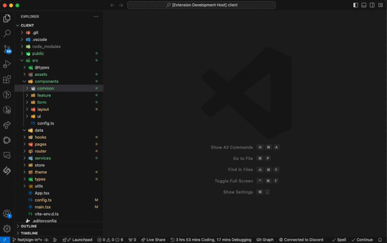

# React Component Generator

## Introduction

React Component Generator is a Visual Studio Code extension that simplifies and accelerates the process of creating React components. With just a few clicks, you can generate boilerplate code for new React components, complete with optional TypeScript support, props interface, and various file structure options.





## Features

- Quick generation of React component boilerplate code
- Support for functional components with optional props
- TypeScript support out of the box
- Multiple file structure options:
  1. Single file component
  2. Component with separate index file
  3. Component with separate index and style files (SCSS or CSS)
- Customizable component folder location

## Installation

1. Open Visual Studio Code
2. Go to the Extensions view (Ctrl+Shift+X or Cmd+Shift+X on macOS)
3. Search for "React Component Generator"
4. Click on the "Install" button

## Usage

1. Open a React project in VS Code
2. Open the Command Palette (Ctrl+Shift+P or Cmd+Shift+P on macOS)
3. Type "Create React Component" and select the command
4. Follow the prompts to:
   - Select or create a target folder
   - Name your component
   - Choose whether to include props
   - Define prop names and types (if applicable)
   - Select the desired file structure

That's it! Your new React component will be generated in the specified folder.

<!--  -->

## Example

Here's an example of a generated component with props:

```typescript
import React, { memo } from 'react';

interface MyComponentProps {
  name: string;
  age: number;
}

function MyComponent({ name, age }: MyComponentProps) {
  return (
    <div>
      <h1>{name}</h1>
      <p>Age: {age}</p>
    </div>
  );
}

MyComponent.displayName = 'MyComponent';
export default memo(MyComponent);
```

## Configuration

Currently, the extension uses default settings. Future versions may include customizable options through VS Code's settings.

## Contributing

Contributions are welcome! Please feel free to submit a Pull Request.

## License

This project is licensed under the MIT License - see the [LICENSE](LICENSE) file for details.

## Support

If you encounter any problems or have any suggestions, please [open an issue](https://github.com/javier1234559/react-component-generate/issues) on our GitHub repository.

## About the Author

This extension was created by CodeWithJavier. You can find more of my work on [GitHub](https://github.com/javier1234559).

Enjoy using React Component Generator!